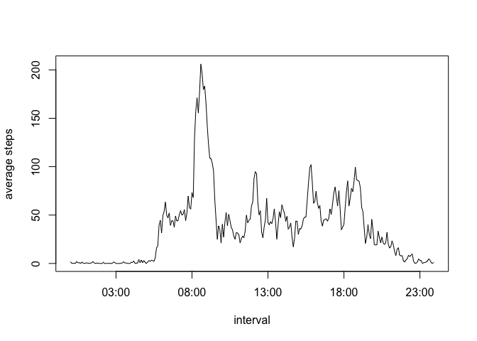
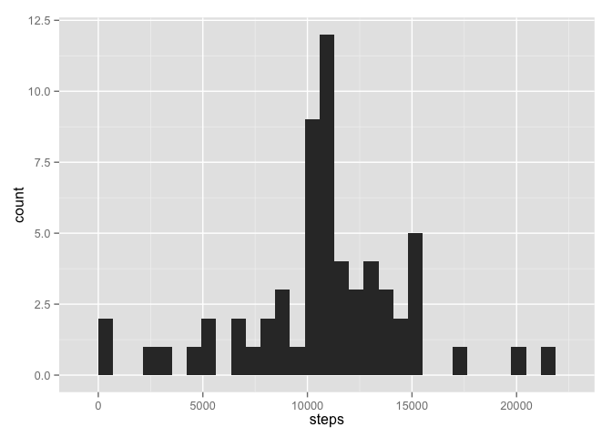
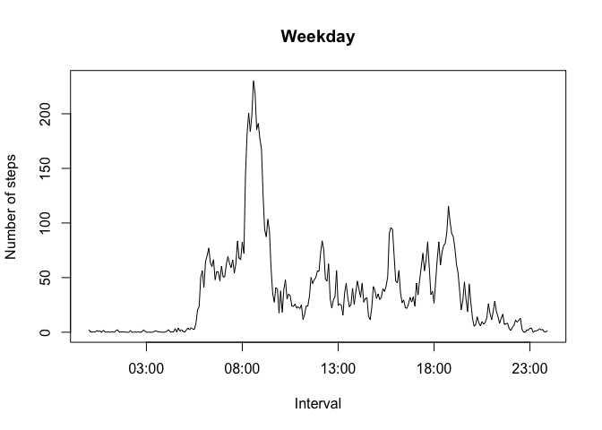
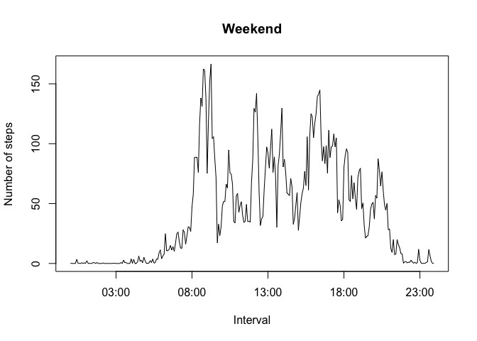

# Reproducible Research: Peer Assessment 1


## Loading and preprocessing the data
Read the data assuming that the unzipped csv file is in the working directory

```r
dt <- read.csv("activity.csv", header=T, stringsAsFactors=F)
library(ggplot2)
library(dplyr)
```

```
## 
## Attaching package: 'dplyr'
## 
## The following object is masked from 'package:stats':
## 
##     filter
## 
## The following objects are masked from 'package:base':
## 
##     intersect, setdiff, setequal, union
```

## What is mean total number of steps taken per day?

```r
# caculate total number of steps by date
sum <- summarise(group_by(dt, date), steps=sum(steps))
sum
```

```
## Source: local data frame [61 x 2]
## 
##          date steps
## 1  2012-10-01    NA
## 2  2012-10-02   126
## 3  2012-10-03 11352
## 4  2012-10-04 12116
## 5  2012-10-05 13294
## 6  2012-10-06 15420
## 7  2012-10-07 11015
## 8  2012-10-08    NA
## 9  2012-10-09 12811
## 10 2012-10-10  9900
## ..        ...   ...
```

```r
# histogram
ggplot(sum, aes(x=steps)) + geom_histogram()
```

```
## stat_bin: binwidth defaulted to range/30. Use 'binwidth = x' to adjust this.
```

 

```r
# mean and median
summary(sum$steps)
```

```
##    Min. 1st Qu.  Median    Mean 3rd Qu.    Max.    NA's 
##      41    8841   10760   10770   13290   21190       8
```

## What is the average daily activity pattern?

```r
# average steps per interval
int <- summarise(group_by(dt, interval), steps=mean(steps, na.rm=T))
# convert integer interval to time format interval
# example: "105"" -> "0105""
int$interval <- sprintf("%04d", int$interval)
# plot
#ggplot(int, aes(x=strptime(int$interval, format="%H%M"), y=steps)) + geom_line()
plot(strptime(int$interval, format="%H%M"), int$steps, type="l", xlab="interval", ylab="average steps")
```

 

```r
# which interval contains maximum num of steps
filter(int, steps==max(int$steps))
```

```
## Source: local data frame [1 x 2]
## 
##   interval    steps
## 1     0835 206.1698
```

## Imputing missing values

```r
# number of missing value
nrow(dt[!complete.cases(dt), ])
```

```
## [1] 2304
```

```r
# filling in missing value
filled.dt <- dt
# use mean of steps per interval for missing value
filled.dt[!complete.cases(filled.dt), ]$steps <- int$steps
# histogram total number of steps taken each day
filled.sum <- summarise(group_by(filled.dt, date), steps=sum(steps))
ggplot(filled.sum, aes(x=steps)) + geom_histogram()
```

```
## stat_bin: binwidth defaulted to range/30. Use 'binwidth = x' to adjust this.
```

 

```r
# mean and median
summary(filled.sum$steps)
```

```
##    Min. 1st Qu.  Median    Mean 3rd Qu.    Max. 
##      41    9819   10770   10770   12810   21190
```
There you can see the median is now equal to the mean, which is the result of filling in missing value

## Are there differences in activity patterns between weekdays and weekends?

```r
# convert string date to Date object
filled.dt$date <- as.Date(filled.dt$date)
# add another column representing weekday or weekend
weekdays <- weekdays(filled.dt$date)
isWeekend <- factor(weekdays == "Saturday" | weekdays == "Sunday")
levels(isWeekend) <- c("weekday", "weekend")
filled.dt <- mutate(filled.dt, day=isWeekend)
head(filled.dt)
```

```
##       steps       date interval     day
## 1 1.7169811 2012-10-01        0 weekday
## 2 0.3396226 2012-10-01        5 weekday
## 3 0.1320755 2012-10-01       10 weekday
## 4 0.1509434 2012-10-01       15 weekday
## 5 0.0754717 2012-10-01       20 weekday
## 6 2.0943396 2012-10-01       25 weekday
```

```r
# multiplot
weekday <- filled.dt %>% filter(day=="weekday") %>% group_by(interval) %>% summarise(steps=mean(steps)) %>% mutate(interval=sprintf("%04d", interval))
weekend <- filled.dt %>% filter(day=="weekend") %>% group_by(interval) %>% summarise(steps=mean(steps)) %>% mutate(interval=sprintf("%04d", interval))
par(mfrow=c(1,1))
plot(strptime(weekday$interval, format="%H%M"), weekday$steps, type="l", xlab="Interval", ylab="Number of steps", main="Weekday")
```

 

```r
plot(strptime(weekend$interval, format="%H%M"), weekend$steps, type="l", xlab="Interval", ylab="Number of steps", main="Weekend")
```

 
